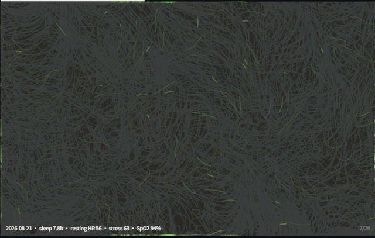
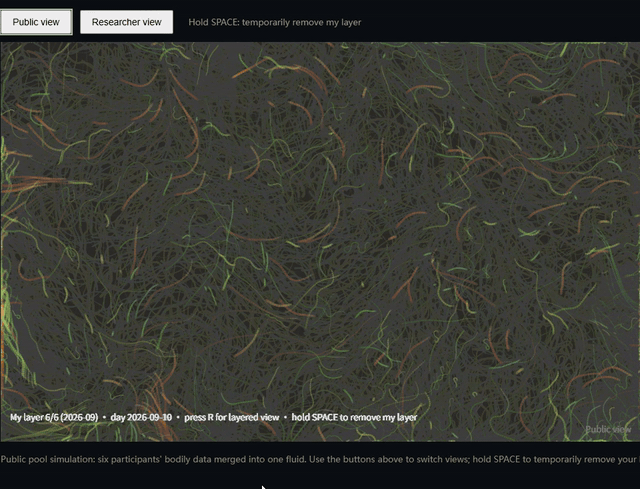

# Data-Viz Pilot

**Body data, painted as breathing fluid.** An experimental two-mode visualisation instrument for wearable health data: a generative abstract fluid alongside conventional small-multiple charts, with a built-in study flow (consent → pre-survey → viewing → post-survey) and an anonymised public pool simulation.

参与者用自己的可穿戴数据，在"抽象生成流体 / 常规图表"两种可视化之间对照观看，问卷测量理解、信任、情绪与公共池出让意愿。中英双语（默认中文，右上角切换 EN）。

## Quickstart

The app reads `viz/data/huawei_daily.csv`. A synthetic `mock.csv` is included, so a fresh clone needs one copy step:

```bash
cd viz
cp data/mock.csv data/huawei_daily.csv
cp data/mock.csv data/huawei_daily_full.csv   # needed for ?days=all and ?mode=pool
python -m http.server 8000
# open http://localhost:8000
```

(Double-clicking `index.html` will not work: browsers block local file reads under `file://`.)

Useful URL parameters: `?lang=en` · `?mode=abstract|chart` · `?day=YYYY-MM-DD` (freeze one day) · `?days=all` (fast-run the full archive) · `?mode=pool` (public pool simulation) · `?view=layers` (researcher view) · `?step=pre|viewing|post|done` (skip ahead, testing only). In the pool, **R** toggles public/layered view; holding **SPACE** temporarily removes "my" layer.

## Repository structure

```
data-viz-pilot/
├── viz/                  # the instrument (p5.js single-page app)
│   ├── index.html        # entry point: four-step wizard
│   ├── sketch.js         # particle fluid + chart modes + pool simulation
│   ├── app.js            # wizard flow, i18n, session log, JSON export
│   ├── lib/              # localised p5.js
│   └── data/
│       ├── mock.csv                  # synthetic sample data (tracked)
│       ├── huawei_daily.csv          # personal — gitignored
│       └── huawei_daily_full.csv     # personal — gitignored
├── scripts/
│   └── huawei_to_daily.py            # pipeline: raw Huawei export → daily CSV
├── media/                  # screen recordings of the two demo modes
├── consent/              # consent form draft
├── questionnaire/        # questionnaire draft
├── sessions/             # session JSON exports (gitignored)
└── data/                 # full-archive daily CSV (gitignored)
```

## Data format

`date,resting_hr,sleep_min,spo2,stress,sleep_capped`

Daily granularity; `sleep_capped=1` marks days truncated at 960 min (bad-merge / extreme-day guard). To use your own records, export daily summaries from your wearable provider and shape them to this schema, then drop them in as `viz/data/huawei_daily.csv`.

## Demo recordings

**Personal view** — the abstract fluid evolving day by day, chart mode, and the post-viewing questionnaire flow:



([full video via Pages](https://txiao9331.github.io/data-viz-pilot/media/demo_person.mp4) · [repo file](media/demo_person.mp4))

**Public pool simulation** — the merged fluid, the R-key toggle to the layered researcher view, and the space-bar probe that temporarily removes "my" layer:



([full video via Pages](https://txiao9331.github.io/data-viz-pilot/media/demo_public_pool.mp4) · [repo file](media/demo_public_pool.mp4))

## Privacy by design

Personal health data is **never committed**: raw exports, derived CSVs, and session logs are all gitignored. Open-text answers are exported separately from session metadata. Consent form and questionnaire drafts are included so the study flow is reviewable end to end.

## Status

v0.5 — single-participant pipeline complete (data → visualisation → four-step flow → pool simulation → JSON export). Next: small-group participant runs.

## Acknowledgement

The abstract mode is an Anadol-style homage; the original *Unsupervised* runs on GPU-cluster ML models, this runs on four daily metrics.
